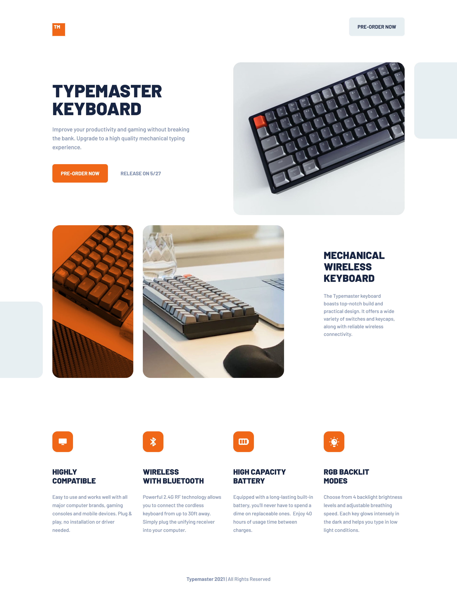

<h1>Typemaster pre-launch landing page</h1>

This is my first project using Tailwind CSS 
and I should say, this was so much fun!

[Live URL](https://ivaberiashvili.github.io/typemaster-pre-launch-landing-page/) | [Solution]() | [Challenge on Frontend Mentor](https://www.frontendmentor.io/challenges/typemaster-prelaunch-landing-page-J6-Yj5J-X)
:-------------------------:|:-------------------------:|:-------------------------:

## The challenge

Users should be able to:
- View the optimal layout depending on their device's screen size
- See hover states for interactive elements

## The Solution

### Built with

- Semantic HTML
- Tailwind CSS
- Mobile-first workflow

### Author
- [Iva](https://github.com/ivaberiashvili/)

